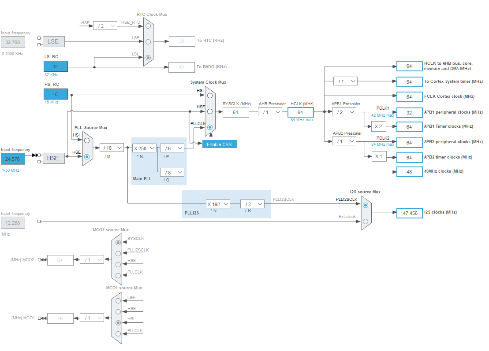

[](https://results.pre-commit.ci/latest/github/elagil/usb-i2s-bridge/main)

# USB-I2S audio bridge

This is a firmware project that mainly implements a UAC 1.0 compliant sound card.

The software is designed to run on the [STM32F401](https://www.st.com/en/microcontrollers-microprocessors/stm32f401.html) - in particular the cheaply available STM32F401RB, which has the lowest amount of flash memory and RAM of all STM32F401 class devices.
Thus, this firmware also runs on any of the larger variants (STM32F401RC, STM32F401RD, STM32F401RE).

Theoretically compatible controllers (any memory configuration) are
- STM32F401Rx
- STM32F411Rx (untested)
- STM32F412Rx (untested)
- STM32F413Rx (untested)
- STM32F423Rx (untested)

as they all fulfill the peripheral requirements (I2S, USB OTG) and come in pin-compatible footprints (the letter R denotes 64-pin LQFP). Only the STM32F401Rx has been tested as of now.

The project is based upon the real-time operating system [ChibiOs](https://www.chibios.org/dokuwiki/doku.php) and inspired by [a demo project](https://forum.chibios.org/viewtopic.php?f=16&t=926&start=20) with heavy modifications.

# Features

The firmware supports:
- Any combination of: 16 bit or 32 bit resolution / 48 kHz or 96 kHz sample rate (selectable in [the audio configuration file](./source/audio/audio_settings.h))
- Mute control
- Volume control

The audio stream is never manipulated.

# Building

The firmware is built with `make` and the [GNU Arm Embedded Toolchain](https://developer.arm.com/downloads/-/gnu-rm). With the toolchain installed and in your `path`, simply run

```bash
make
```

in the root of the repository for building the default application with 48 kHz sample rate at 32 bit resolution.

Choose a specific application by appending the `APP` switch, e.g.

```bash
make APP=blus-mini
```

The available applications are found in [the applications folder](./apps).

For changing the audio sample rate, or the resolution, please adjust [the audio settings file](./source/audio/audio_settings.h).

# Hardware requirements

The firmware is built around the STM32F401(RB), but can be ported to other devices that are supported by ChibiOs and have the required peripherals.

It is made to run on [blus-audio hardware](https://github.com/blus-audio/hardware). The [applications directory](./apps/) contains implementations that run on different variants of the blus hardware.

## Clocks

The firmware assumes an externally connected (HSE bypass) clock source with a frequency of 24.576 MHz. By default, the PLL settings result in a system clock of 64 MHz. Using the I2S PLL as the I2S clock source, the I2S peripheral runs at 147.456 MHz with the provided PLL settings.

- Error-free I2S clocks for audio sample rates are available (48 kHz, 96 kHz).
- Error-free 48 MHz clocks are provided.

Find the clock tree, generated with CubeMX, below.


## GPIO

The following IO assignments are used in this firmware, but can be adjusted for valid replacements:

- USB connectivity on `PA11` (`USB_DM` - data negative) and `PA12` (`USB_DP` - data positive), optionally `PA9` (`OTF_FS_VBUS` - VBUS sensing, unused).
- I2S master output on `PA4` (`I2S3_WS` - left-right clock), `PC7` (`I2S3_MCK` - master clock), `PC10` (`I2S3_CK` - bit clock), and `PC12` (`I2S3_SD` - data output).
- Connection between `PA0` (`TIM2_ETR`) and `PC7` (`I2S3_MCK`). The timer peripheral uses the I2S master clock output as a counting clock input. This allows to accurately measure the sound card's output sample rate with regard to the USB host's start of frame (SOF) frequency. For more detail, see the description of [the feedback mechanism](#feedback-mechanism).

Additional assignments are used for functionality that is not directly related to USB audio:

- USART connectivity on `PA2` (`USART2_TX` - transmit) and `PA3` (`USART2_RX` - receive) for reporting and debugging.
- I2C control lines for the connected amplifiers.
- An analog input for a volume potentiometer (unused).

# Design

The following sections illustrate the functionality and design choices for the firmware package.
This section will be gradually extended.

## Feedback mechanism

In general, the USB sound card and the host machine that it connects to, do not share the same clock domain. Their respective reference clocks are therefore different. This is caused by component tolerances or imperfections - especially in oscillators.

In consequence, the USB host most likely provides audio samples at a different rate than the sound card's I2S peripheral consumes them at.
Inevitably, if the host fills up an audio buffer on the device via USB, and the I2S peripheral consumes data from the same buffer, the clock discrepancy will cause the buffer fill size to increase or decrease over time. How fast the fill size changes, depends on the amount of clock discrepancy.
At some point, the buffer write (USB) and read (I2S) pointers will meet, and the buffer over- or underruns. This leads to audible artifacts.

While larger audio buffers can partially hide this issue, by making it appear less frequently, they cause additional latency.

In order to mitigate the buffer fill size drift, the standard suggests a feedback mechanism. The sound card shall measure its actual output sample rate with reference to the USB start of frame (SOF) clock, and report it to the host. In full-speed USB, the SOF period is specified to be 1 ms long.

In the implementation of this firmware, a hardware timer is clocked by the I2S master clock output. The timer counts clock cycles for a specified amount of SOF periods - in this case 64 (equals 64 ms). From that counter value, a feedback value is derived and submitted to the host.

This feedback mechanism is a control loop, where the sound card (USB device) is a mere *sensor* and the host machine (USB host) is the *controller*.

For more detail, see [UAC 1.0 specification](./doc/audio10.pdf). The audio feedback mechanism is implemented as described in *3.7.2.2 Isochronous Synch Endpoint* (p. 32).
An extended description is found in the [general USB 2.0 specification](./doc/usb_20.pdf) in *5.12.4.2 Feedback* (p.75).
